# Color2GrayImgConversion

Implementation of color-to-gray image conversion using salient colors and radial basis functions.

## Short Description

This method employs quantization of an image’s salient colors combined with radial basis functions (RBFs) to convert color images to grayscale. It optimizes contrast retention by mapping a small set of dominant colors, identified through k-means clustering, to corresponding grayscale intensities. This ensures the preservation of important visual contrasts in the resultant grayscale images, making it effective for applications where contrast fidelity is crucial.

Additionally, this method adapts differently when converting natural versus synthetic images. For natural images, which often have a wider range of colors and subtler gradients, the process focuses on preserving the richness and depth of the original scene. For synthetic images, which typically feature more defined and fewer colors, the conversion emphasizes clarity and accuracy in replicating the distinct colors and sharp contrasts. Examples of conversions for both natural and synthetic images are provided below.

**Three main steps** of this color-to-gray image conversion:

    1. Quantization Process
    2. Assigning Gray Values
    3. Final Image Rendering

## Acknowledgements

 - [Implemented according to the paper by Zhang L., Wan Y., published Feb. 22, 2024](https://www.spiedigitallibrary.org/journals/journal-of-electronic-imaging/volume-33/issue-1/013047/Color-to-gray-image-conversion-using-salient-colors-and-radial/10.1117/1.JEI.33.1.013047.full#_=_)

## Usage

### Compilation

```
make
```

### Execution

```
./ZhangWan24 [<input_image>] [<max_k>] [<sigma>] [<ordering>] [<edge_repair>]
```

- ```input_image``` is color image input for conversion,
- ```max_k``` is maximum number of quantized colors (clusters),
- ```sigma``` controls the spread of the Laplace kernel's influence. All colour values are normalised to [0,1] as in the paper, so sigma is on that scale too (e.g. 0.1, the paper gives no value).
- ```ordering``` (optional) selects how gray values are assigned to the quantized colors: 1 = by rgb2gray value (paper Sec. 3.2.1), 2 = by weighted Lab distance (paper Sec. 3.2.2, default).
- ```edge_repair``` (optional, **extension, not part of the paper**): 1 = repair the gray value of blended (anti-aliased) edge pixels, 0 = off (default, pure method of the paper). See "Extension" below.

## Interpretation Of The Paper

The paper contradicts itself in a few places (text vs. figures vs. equations) and leaves some values out. Where it contradicts itself, this implementation follows the reading that is supported by two independent places in the paper, or the only reading that gives a working algorithm.

| Place in the paper | What is printed | Implemented | Reason |
|---|---|---|---|
| Sec. 3.1 text vs. captions of Fig. 4 and Fig. 5 | text: quantization "directly in the CIELab color space", captions: "RGB color space with perceptual distance in the CIELab color space (our method)" | RGB centroids, CIELab distance | both captions agree, the text itself calls the Lab-only result "unnatural", and delta = 1/255 in Eq. (1) is the step of an 8-bit pixel value |
| Eq. (5), MSEG | absolute error \|g(x) - g(Q(x))\| | squared error | named "mean square error of gray", in Fig. 7 MSE, MSEG and M are all ~3e-4 at k = 30, which is only possible for a squared gray error |
| Scale of theta_0, theta_1 | 0.0004, 0.00065, scale not stated | all values normalised to [0,1], Lab as L/100, (a+128)/255, (b+128)/255 | the paper normalises 8-bit values to [0,1], with this the thresholds stop at k = 7-9 on the simple test images, while detailed photos reach max_k |
| Eq. (4) | (MSE[i] - MSE[i-1]) / MSE[i-1] <= eps | absolute value of the relative change | the MSE decreases, so without the absolute value the loop would always stop after one iteration |
| Eq. (8) | log, maximum entropy 8 | log2 | the maximum is 8 only with log2 |
| Eq. (15) | exp(-\|\|x - x_c\|\| / (2 sigma^2)) | squared distance | definition of the Gaussian kernel (not used, Laplace kernel Eq. (17) is used) |
| Eq. (16) | a_i inside the sum | k x k linear system solved for a_j | text: k unknowns with a unique solution (Cramer's rule) |
| D_PCA (Sec. 3.1) | "the maximum number of the pixels on this direction" | first principal component of the pixels of the split colour | PCA |

Not given in the paper, chosen here: sigma of the Laplace kernel (command-line parameter, e.g. 0.1 on the [0,1] scale) and the per-cluster MSE used to pick the colour to split (mean squared error of the cluster).

## Extension (not part of the paper)

The method maps every colour to a gray value without looking at where the pixel is. Pixels on the border of two regions often have a blended colour (anti-aliasing), and such a colour can be closer to a third salient colour (step 2) or fall between two RBF centres (step 3). It is then mapped to a gray value outside the range of the two regions, which shows up as thin dark or white lines along region borders, mostly in synthetic images.

With ```edge_repair``` = 1, two steps are applied after step 3:

1. **Borders of two regions.** A pixel whose RGB colour is a linear blend of the colours of two opposite pixels (distance 1 or 2, four directions) gets the same blend of their two gray values if its own gray value lies outside the gray range of those two pixels or differs from that blend by more than 8 gray levels.
2. **Junctions (three or more regions meet).** The colour of the pixel is fitted as a blend of 1-3 colours of the flat regions within a radius of 2 pixels, if the fit is close and the gray value differs from the same blend of the region gray values by more than 8 levels, it is replaced by that blend. Only gray values of flat region pixels are used here, so one wrong border pixel cannot spread to its neighbours. Without this step, single dark or bright dots remained where several regions meet, mainly with ordering 1, which gives very different gray values to similar colours.

Flat region pixels (4 or more neighbours of nearly the same colour) and pixels that have the colour of a neighbouring flat region are never changed: the gray value is a function of the colour, so they already have the gray value of their region. All other pixels are unchanged. On the kaleidoscope test image this removes the border lines and the dots at the junctions and keeps the borders straight (4-6 % of the pixels change), on photos 4-17 % of the pixels change, only along colour edges.

## Examples Of The Conversion

All results below were produced with ```max_k``` = 40 and ```sigma``` = 0.1 (e.g. ```./ZhangWan24 results/natural/parots_sigma25/parots.png 40 0.1 2 0```). The outputs for every test image and every variant are in ```results/<variant>/<natural|synthetic>/<image>/``` (```quantizied_step1.png``` = step 1, ```gray_withoutstep3.png``` = step 2, ```result_bw.png``` = final result), ```results/``` contains the outputs of the first, uncorrected version.

The four variants are: the two orderings of the salient colours proposed in the paper (ordering 2 = distance ordering, Algorithm 2, the default, ordering 1 = rgb2gray ordering, Eq. 11), each without and with the edge repair (extension, not part of the paper).

### Natural images

| Original | Ordering 2 (Algorithm 2, default) | Ordering 1 (Eq. 11) | Ordering 2 + edge repair | Ordering 1 + edge repair |
|:---:|:---:|:---:|:---:|:---:|
|  |  |  |  |  |

| Original | Ordering 2 (Algorithm 2, default) | Ordering 1 (Eq. 11) | Ordering 2 + edge repair | Ordering 1 + edge repair |
|:---:|:---:|:---:|:---:|:---:|
| 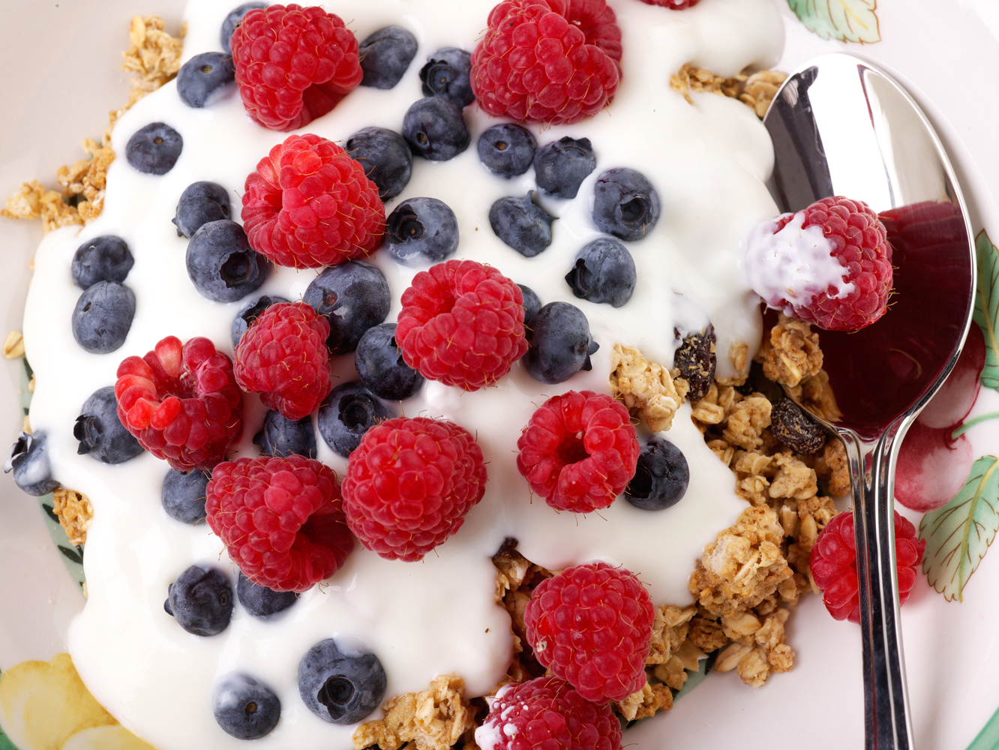 | 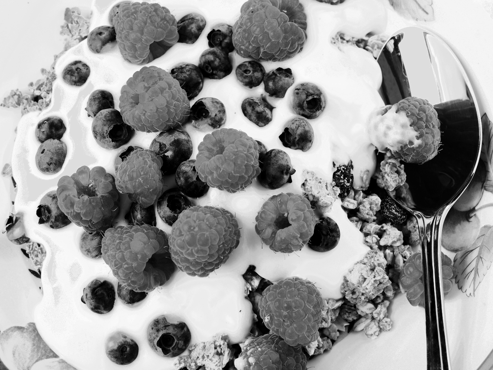 | 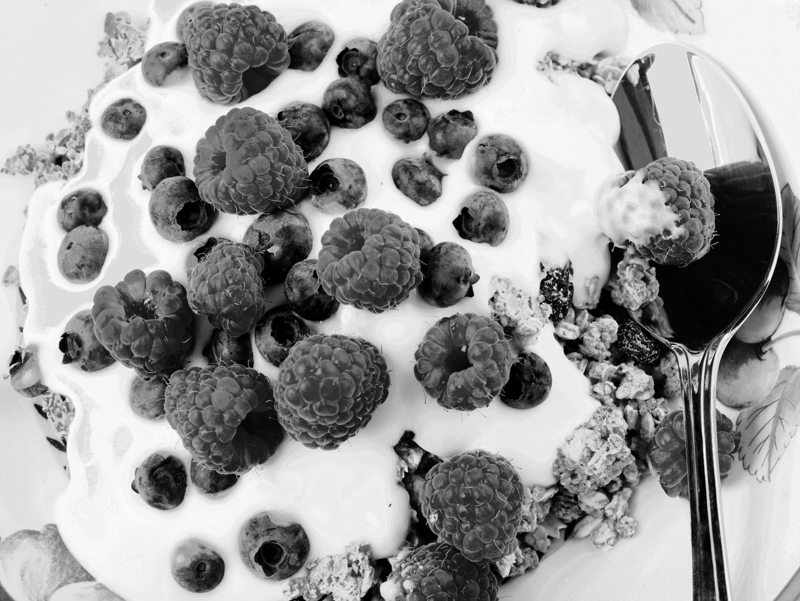 |  |  |

### Synthetic images

The number "2" has nearly the same luminance as the green background, so a standard grayscale conversion loses it, the salient-colour mapping keeps it visible.

| Original | Ordering 2 (Algorithm 2, default) | Ordering 1 (Eq. 11) | Ordering 2 + edge repair | Ordering 1 + edge repair |
|:---:|:---:|:---:|:---:|:---:|
| 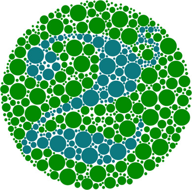 |  |  | 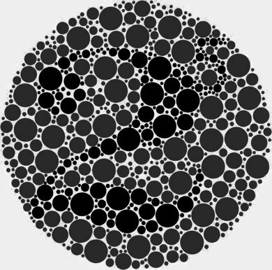 | 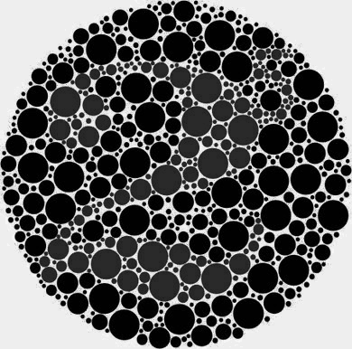 |

Anti-aliased region borders can turn into thin dark or white lines (see "Extension" above), the edge repair removes them:

| Original | Ordering 2 (Algorithm 2, default) | Ordering 1 (Eq. 11) | Ordering 2 + edge repair | Ordering 1 + edge repair |
|:---:|:---:|:---:|:---:|:---:|
| 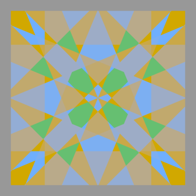 | 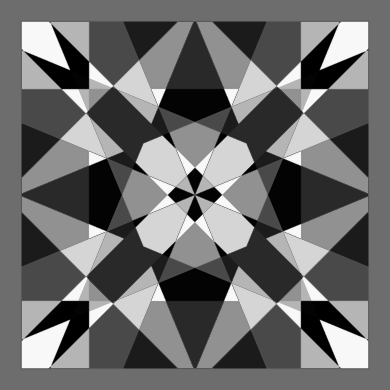 | 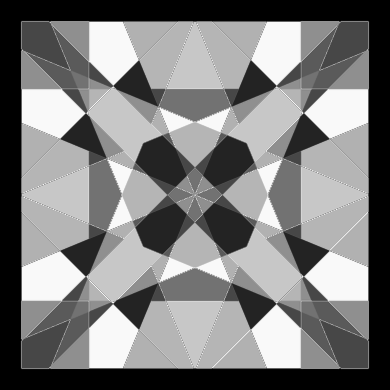 | 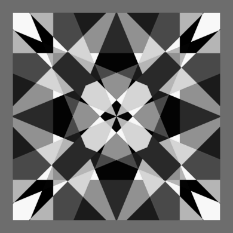 | 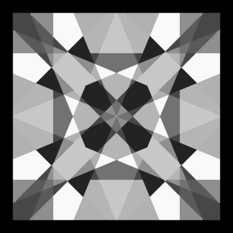 |
